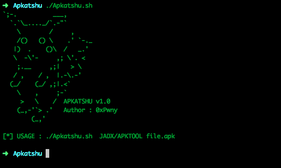

# Apkatshu
- Apkatshu its a Tool for extracting urls , emails , ip address , and interesting data from APK files

  

```text
Apkatshu : tool written in bash/python  for extracting urls, emails, ip addresses, and interesting data from APK files. The user can choose either JADX or APKTOOL for de-compilation.
```

## USAGE :
- JADX : 

./Apkatshu.sh JADX file.apk

- APKTOOL : 

./Apkatshu.sh APKTOOL file.apk

**fixed** :

- add more regex to get more mails 
- .smali for JADX , and .java for APKTOOL
- hide JADX stderr


## Special thanks @chmodxx , @b1337k , @ubernoob for their support
